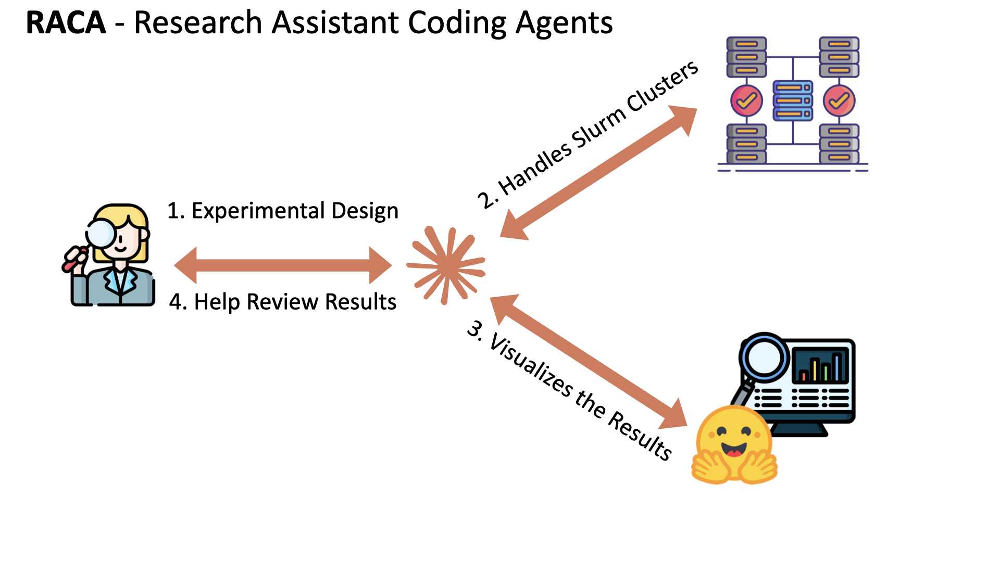
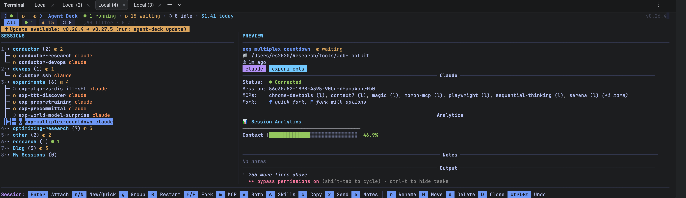
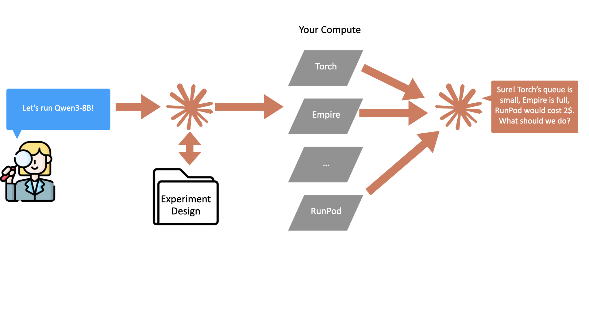
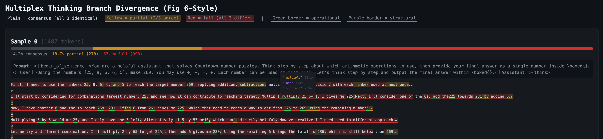

# How Claude Code Changed the Way I Think About Research





The workflow of a PhD student involves turning high-level directions into concrete experiments. Claude Code knows how to help turn:

```text
> Hey, I want to test something on this paper <link>. It has this cool
> Figure 6 that looks like the model can branch its reasoning into
> semantically different regions of the search space, but I want to
> test that. I want to reproduce their code and train a model on
> Countdown then reproduce Figure 6 to see how the latent embeddings
> branch.
```

into a solid experiment with me, implements it on an HPC cluster with Slurm, runs and monitors the job, then visualizes the output for me. I don't write code, I don't do devops, I just talk to Claude.

You can use it here. It glues Claude Code with SLURM/RunPod and HuggingFace, creating a loop of you (the researcher) with compute (HPC/RunPod/local servers) and visualizations + raw data (HuggingFace) in a way that's been very effective for me.

```shell
curl -sSL https://raw.githubusercontent.com/Zayne-sprague/RACA/main/install.sh | bash
```

It will set you up with:
- **SLURM management tooling:** Claude Code can interact with your clusters over SSH (install, run, monitor, all set up for you).
- **Visualization website:** Hosted with HuggingFace Spaces, Claude Code creates custom visualizations for each experiment and manages tracking experimental outputs.
- **Skills and rules for experimental control:** A pipeline I found helpful for designing and ensuring experiments run as they should.
- **Tips and tricks:** A single workspace, skills for managing data discovery, pointers to great optional tooling, and more.

Most of the install is helped by with Claude, it will walk you through everything. Let me know what you think :)

If you want to stick around and read about how it works, how it doesn't, and how it's changing how I think about conducting experiments, keep reading.

[//]: # (![Dashboard]&#40;images/dashboard.png&#41;)
[//]: # (_The Experiments Dashboard where Claude Code keeps track of my experiments for me. They are tracked on the experiment dashboard. Claude Code builds the scripts for the experiment, handles the uploads to huggingface, writes the code to visualize them on the site, and manages the updates for each experiment so I can have everything in one spot._)

_Example of the Research Dashboard that keeps track of all the experiments and its related outputs, files, etc. Along with an example of how you can talk to Claude Code normally, ask about your job scheduled on your slurm clusters, and have it respond. A key motivation of RACA is keeping Claude Code local and connecting it with compute via ssh._

## Intro

Autoresearch has been all the rage in the past few months. But the reality is that most of us doing research aren't trying to fully automate science. We're trying to stop spending our days on devops. I've found that one of the hardest things a Ph.D. teaches you is designing experiments that actually answer your question. Obvious in principle, hard in practice. This is still hard even with the best Claude Code setup, but for a completely different reason than it was 2-3 years ago. Before, it was all tedious infrastructure and finding/fighting for compute. Claude Code has shifted the difficulty entirely from devops to control.

With Claude, I find I can manage about 3x more parallel threads of research than before, letting me explore ideas that I previously would have triaged away. But this doesn't necessarily translate into 3x's more papers, and there are some serious hangups...

This post is about how I've been using Claude Code to run experiments as a Ph.D. student, what it looks like in practice, and the new ways things break (and what the fixes actually look like). I'm releasing the GitHub repo for people who want to try it themselves. It's genuinely helped my productivity. But more than that, working this way has started to change how I think about research itself: what kind of knowledge is worth building up, where the bottlenecks actually are now, and what it means to "fix" something when the code is disposable but the understanding isn't.

## What It Looks Like

I was interested in the Multiplex Thinking paper (arxiv 2601.08808). Instead of generating one token at a time during chain-of-thought, you sample K candidate tokens at each position and merge their embeddings before feeding them to the next layer. The paper claims this lets the model explore multiple reasoning branches in parallel.

I really liked the paper and idea, plus it had great pass@k performance on many math benchmarks. But Figure 6 showed this visualization of how the "latent" thoughts were broken out across the top-k tokens, and I wanted to know: for search tasks like Countdown (given the numbers [2, 5, 7, 10] reach the target 32; 10 / 2 * 5 + 7 = 32), would those top-k tokens be different branches of the search, or would they all be synonyms (more like token smoothing)? This is not my main research thread, but I wanted to know. so I asked Claude.

### How Do We Turn That Prompt Into An Experiment?

With some of the right tools (SuperPowers + AgentDeck, see below), Claude automatically reads the paper, finds the repo, identifies the key files in their custom sglang and transformers forks, and asks me questions to nail down the design:

```text
[... tool calls / agents reading and downloading code ...]

I've read through their code. A few questions:
1. They use K=3 for multiplex width. Want to stick with that?
2. For a baseline, standard single-token CoT with the same model and
   data would be the cleanest comparison. Sound right?
3. I found your Countdown data generators from the algorithmic SFT
   project. We can reuse those. What difficulty level?
4. How many training steps? They used 300 in the paper.
```

This flow benefits from having all of the work you're currently doing in a single repo rather than across separate Claude Code projects. It reused my code from an older experiment, one that I trusted to work right.

As a result, RACA expects the following structure:

> **Workspace:** I keep everything in `~/Research`. Projects, notes, tools, repos. Not always context-friendly (you have to organize so Claude can find things), but it lets conversations span my whole research history. There's a `notes/experiments/` folder where Claude writes plans, timelines, and artifact registries, and where I put my own notes. If you install, the first thing it asks is where you want your workspace.

> **Tools:** [Superpowers](link) makes Claude more proactive during design, asking clarifying questions instead of waiting for me to specify everything. [Agent-Deck](link) orchestrates multiple sessions and lets you set `--dangerously-skip-permissions` so Claude can run commands without stopping to ask at every step. **If you use our GitHub command to install, Claude Code will help you get these tools setup auto-magically!**


_An example of my agent deck main window. You can see I have a few experiments all being worked on in parallel, managed by a Conductor usually (a Claude Code session managing Claude Code sessions). Conductors are nice but Agent-Deck really helped me orchestrate, instead of 24 terminal tabs, I just have 1._

The output for this stage is an experiment README file in my workspace's experiments folder. The creation and placement of this file is driven by a series of rules I've defined in `~/Research/.claude/rules`, more on this soon.

### Is the Experiment Designed Right?

After running a few of these experiments over the last couple months, I've found the next most important question is: how do I quickly tell this was designed right? So much time, even before Claude Code, was spent submitting jobs, waiting hours, then seeing it fail from a bug or worse a logic error that only showed up after I looked at the output. These problems still persist with Claude Code. It can still make a coding error or those tedious logic errors (like setting max-tokens to 512). This is why I have my Claude Code set up to do "red-teaming" right after designing experiments.

Red-teaming answers a series of questions:
- Where could this experiment fail? What should we look out for?
- What must be held constant for the experiment to work? (invariants)
- How can we test that our experiment will actually run? (no bugs)

What happens is that the agent produces a red-team brief, a markdown file with all of this information, including a **canary job**. The canary is meant to be a quick job (under 2 hours) that tests the experiment's code end-to-end. It requires less hardware and less time, meaning it gets queued faster and if it fails, we iterate faster. Most importantly, it produces output that is then validated by Claude to ensure the experiment's invariants are met (model responses not truncated, correct format, etc.).

> **How rules work:** Claude Code lets you define rules in `.claude/rules/` that guide behavior. They're more like strong suggestions than hard constraints (Claude doesn't always follow them), but they can encode a pipeline. I never have to ask for red-teaming; the rule says to do it before any compute gets scheduled for a new experiment.
 

_Example of how Claude can talk to your compute clusters to find available GPUs that you need for your experiment. It doesn't just find compute though, you can use Claude Code locally to handle the installation, monitoring, submission, etc. of your jobs on your SLURM cluster, third-party providers (RunPod, etc.), or your local machines. It makes it so that you don't have to manage multiple sessions on multiple machines, just use ssh and claude code._

For this experiment, the canary surfaced a calibration issue:

```text
I've set up a canary run: Qwen3-8B solving Countdown with 6 digits,
K=3 multiplex, 10 training steps. Submitting to Empire for 2 hours.
I'll check back when it completes.
...
The canary completed. Accuracy is at 70%. That might be too easy
for Countdown, the model barely needs to search.
```

**> Bump it to 7 digits and see?**

```text
Resubmitting...
...
Accuracy dropped to 35%. Within our target range.
```

**> Can you show me some model outputs so I can check they're healthy?**

```text
Sure! Load them up here: http://<visualizer link>
```

**> These look good. Let's run the real thing.**

The first canary actually failed before any of this (Hydra config issue, needed `+` prefixes). Claude caught it in the logs, fixed the config, and resubmitted. No sbatch scripts from me, no SSH beyond the initial `raca auth empire`. It fixed this automatically, but the one above did prompt me because it changes an invariant in the red team briefing (the number of digits we test for in Countdown).

> **Finding compute:** In this stage, Claude connects to your cluster via SSH, installs the code, and schedules the canary job. You may have to tell it a bit about how SLURM jobs work on your cluster, but by and large, it just does what it needs to. This is the biggest advantage of using Claude Code in my opinion. After spending weeks trying to install packages on complex architectures, Claude Code is a game changer.

When the experimental design is compliant with the red-team brief and the canary job succeeds, we go run the big job.

### Production Training and Analysis

Once the canary passes, Claude schedules production training: 3-hour Slurm windows with checkpoints every 25 steps, all logs to WandB, automatic resubmission when each window times out. By step 148, baseline was at 82.2% accuracy and multiplex at 77.4%.

While training was still running, I didn't have to wait. I asked Claude to schedule a quick 15-minute inference job to reproduce Figure 6 using the step-125 checkpoint. It wrote the inference script hooking into sglang's top-K internals, scheduled it, and built a trace viewer on the dashboard. This would have taken me a considerable amount of time by hand: custom inference code, a classification scheme, a visualization tool. It was running the same afternoon. You do still interface with Claude to help it debug ("look at their code, how did they solve inference? Can we reuse that before writing our own?"), but this type of debugging is much more hands-off than doing it myself.

### Reviewing

My role now is primarily reviewing. The session keeps track of all artifacts and syncs them to the dashboard. All artifacts go into the website visualizer. If I'm not in my Agent-Deck terminal watching over sessions or reading papers, I'm in the experiment website looking at artifacts, HuggingFace datasets, and WandB to make sure the experiment did what it should and to synthesize findings.



In this case, Claude Code wrote a fairly complex UI that shows the top-1 token as the continuation, but when you highlight over a token, you can see the Top-K (k=3 for this experiment) tokens taken and merged together using the Multiplex-Thinking algorithm.

## When Things Break (And They Do)

This is all very nice. I wrote no code, only talked to Claude Code. With some extra tooling, I had a conversation that turned into reviewing results. However, research is not fully automated yet, and this flow isn't without bugs. Finding these issues is where I spend time now (though considerably less of it than when I was doing devops).

### The Countdown Reward Bug

After the canary passed and production training was running, I checked the artifacts on the dashboard. Accuracy was climbing. Numbers looked great. Then I opened the raw model traces.

The model was outputting `\boxed{383}`. Just the target number, in a box. No arithmetic, no reasoning, no work shown. It had learned that the reward function (`hf_math_verify`) only checked whether the target number appeared inside `\boxed{}`. So it just put the answer there. Every time. Funny enough, it did not have perfect accuracy (the model didn't learn to just copy the target number from the prompt... a question for another time). But this is a very meaningful bug that basically took 200 steps of training and threw it out.

The canary and red-team agent are great, but they aren't a catch-all. These bugs still slip through, so I spend time detecting reward hacks before running the big experiment, or as early as possible. In this case, the canary produced WandB logs, not raw model traces, and so I didn't spot this in my initial round. If I was coding this up myself, I would not have made this mistake. It's obvious to me that this completely bypasses the whole point of the task. But to Claude, that's not the case.

Also, I probably would've made plenty of *other* mistakes that might've made the experiment crash or be even harder to debug. I need to manage the agent, but it's still letting me tackle something in a fraction of the time it would've taken me to do alone.

### Knowledge Over Code

The actual fix for the experimental code was done almost instantly once we found the bug: replace a string match reward function with a new `CountdownJudge`, which validates an arithmetic expression, not just the final number.

But the real bug is: why did Claude Code make this mistake in the first place? It had some reference code to look at. It just didn't. That's a capability gap, and this isn't always quite right. The fix for it isn't more code. It's a reference document.

My immediate reaction was to write a library (I actually already have one) showing how to run inference and evaluate Countdown. My engineering side wanted a clean, importable package. But honestly, that's not the best fix anymore. This is the change in thinking. The more appropriate fix is to write, in plain text, a reference guide for using the dataset Countdown. Just like in the format of this blog. Claude Code can reimplement inference loops, evaluations, and training rewards as many times as it wants. Other models will probably implement them better in the future. What it needs to have are clear written instructions on what the task is and how it works. The fix is not more code. It's clear documentation, referenced when needed (so it doesn't blow up context).

This is the thinking shift I keep arriving at. The traditional way to solve reusable problems in software is to write a library. Shared code, versioned, tested. That's still fine for deterministic utilities. But when your "code" is being written fresh by an LLM every time, what matters is building up the right reference material.

I'm building what I think of as dataset skills: reference documents for each dataset and task I work with. Documents that contain: what the task is, how the data is structured, the original paper, other papers with interesting use cases, known failure modes, how to build reward functions, how to build visualizers, code snippets for common operations, where the data lives. The LLM reads this when it needs to and builds the implementation from scratch.

The fix for the Countdown bug was going from zero documentation, just code and a prompt, to a clear reference document for how to use it, what it is, where to find more info, all in plain English.

We aren't sharing code anymore with Claude Code. We are sharing intermediate representations of code in plain English that Claude Code, and any agent that comes after, will compile into actual code.

## What This Changes

Before: most of my time went to devops, environment debugging, writing SLURM scripts, building one-off visualization tools. Research questions had to be triaged because each one was a multi-week investment. When bugs happened, you wrote better code.

Now: most of my time goes to reviewing raw outputs, reading papers, and coming up with questions. When bugs happen, the fix is usually a better reference document, a new rule, or a more precise description of what the experiment needs: that is, better understanding that Claude can read next time.

This is true for my setup as well. Rules are suggestions that Claude doesn't always follow. But the cycle of "run, visualize, catch the problem, update the knowledge base, run again" is genuinely faster than the old cycle of "plan, plan, plan, set up, debug, debug, debug, debug, wait, debug, set up differently." And it gets better each time because the knowledge accumulates.

Spending more time with Claude Code has made me realize that automation isn't perfect. Software engineers and careful scientists are still needed. But it is a major increase in my productivity. Knowing how to use it effectively is a new skill I'm developing, and I hope the GitHub repo helps others as well. I think there's still much to learn, much to change in how we think and work, and I couldn't be more excited.

If you have suggestions, tooling, ideas, critiques, reach out!

Try out the repo too! Tell me what you think

```shell
curl -sSL https://raw.githubusercontent.com/Zayne-sprague/RACA/main/install.sh | bash
```

[RACA GitHub](link-to-repo) | [Example Dashboard](link-to-space)
