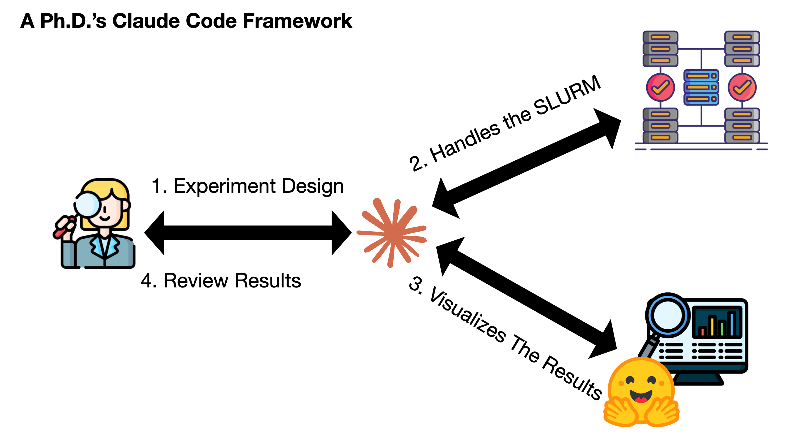
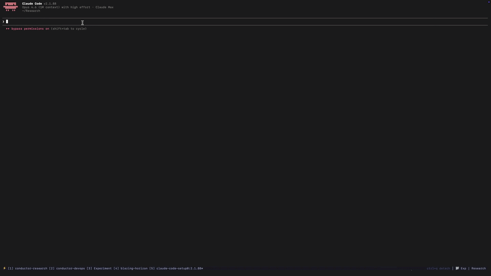

# RACA: Research Assistant Coding Agent

Talk to Claude Code through **experimental design**, **Slurm management**, and **visualization** (the AI Ph.D. students experiments life-cycle)
 
#### Install

```bash
curl -sSL https://raw.githubusercontent.com/Zayne-sprague/Dr-Claude-Code/main/install.sh | bash
```




Turn your experimental pipeline into a conversation. RACA connects Claude Code with your compute (SLURM, RunPod, local GPUs) and a visualization dashboard (HuggingFace Spaces) so you can design, run, and review experiments without writing sbatch scripts or doing devops.


## Install

```bash
curl -sSL https://raw.githubusercontent.com/Zayne-sprague/Dr-Claude-Code/main/install.sh | bash
```

The script sets up your workspace, installs the tools, then launches Claude Code automatically. Claude walks you through the rest: connecting your clusters, deploying the dashboard, and running your first experiment. If you ever need to re-run the setup, use `/raca:onboarding`.

## What You Get


*Claude connects to your clusters over SSH, finds available GPUs, installs dependencies, and schedules jobs. You authenticate once with `raca auth <cluster>` and talk to Claude from there.*


*The Research Dashboard tracks all your experiments, artifacts, and findings in one place. Claude uploads results to HuggingFace and builds custom visualizations for each experiment.*

If you want to know more about how Claude talks to your clusters, manages experiments, builds visualizations, etc., see [Commands and Skills](docs/commands-and-skills.md).

## The Pipeline

```
Talk to Claude → Design → Red-Team → Canary → Run → Harvest → Dashboard
```

No compute without review. No results without validation. Short resumable jobs with frequent artifact uploads. Claude drives the pipeline; you review results and ask questions.

## Optional Tools

RACA works on its own, but these make it better:

- **[Superpowers](https://github.com/anthropics/claude-code-plugins)**: Makes Claude more proactive during design (asks clarifying questions, structured planning)
- **[Agent-Deck](https://github.com/anthropics/claude-code-plugins)**: Run multiple Claude sessions in parallel with a conductor that monitors them all

## Read More

[Blog Post: How Claude Code Changed the Way I Think About Research](RACA_v7_cc.md)

## License

MIT
